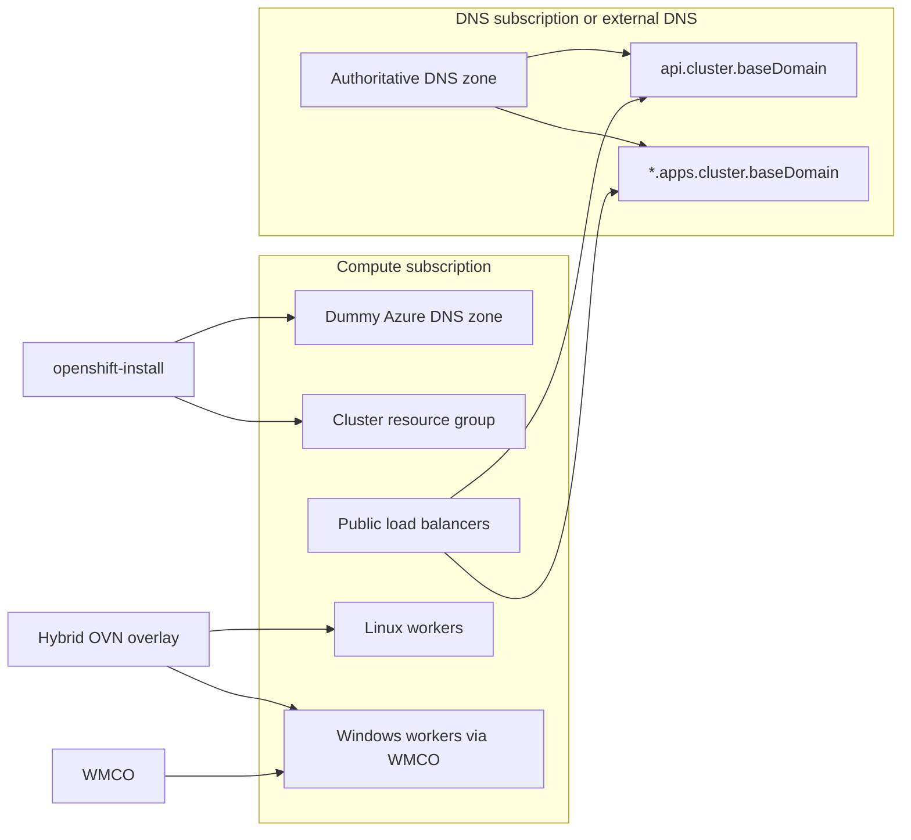

# OpenShift on Azure with Self-Managed DNS and Windows Worker Nodes

## Overview

Installer-provisioned infrastructure (IPI) on Azure normally assumes all resources deploy in the same subscription. To manage cluster DNS from a **different subscription** or from **outside Azure**, use the user-provisioned DNS capability available in Tech Preview for Azure in OpenShift Container Platform **4.21+**.

This guide also covers the OVN-Kubernetes hybrid overlay configuration required to run **Linux and Windows worker nodes** in the same cluster.

Official reference: [Installing a cluster with customizations on Azure](https://docs.redhat.com/en/documentation/openshift_container_platform/4.21/html-single/installing_on_azure/index#installation-initializing_installing-azure-customizations)

## Architecture



- **Compute subscription:** cluster resources, dummy DNS zone (installer requirement only), Linux workers, and Windows workers provisioned by WMCO.
- **DNS subscription (or external DNS):** authoritative `api` and `*.apps` records customers use to reach the cluster.

## Prerequisites

1. The OpenShift installer is installed on the machine used to run installation commands.
2. A dummy public DNS hosted zone for the desired base domain (e.g. `development.techcorp.com`) exists in the subscription where cluster resources will be deployed. No records are added to this zone — it satisfies the installer only.
3. The `oc` CLI is installed (required after cluster installation for Windows node steps).
4. The cluster name in `install-config.yaml` must **not** contain `windows`, `microsoft`, or similar words (Azure identity naming restriction).

## Phase 1: Install the cluster

The steps below assume the OpenShift installer is installed on the machine you will use to run the following commands.

1. Create a new directory (avoid reusing an existing directory) to house the files required for installation of the cluster. e.g. `mkdir ocp-cluster; cd ocp-cluster`
2. Generate the installation files: `openshift-install create install-config --dir .`. Follow the prompts and select the correct options for your deployment. Make sure to remember the name of the cluster as you will need this to create the required DNS records.
3. Open the newly created `install-config.yaml` file and make any changes necessary like the number of replicas, resource group for the network, etc.
4. To enable the user-managed Technology Preview capabilities of the installer, add the following as root-level attributes in `install-config.yaml`:

```yaml
featureSet: CustomNoUpgrade
featureGates: ["AzureClusterHostedDNSInstall=true"]
```

5. Under `platform.azure`, add `userProvisionedDNS: Enabled`. The guide-specific fields in `install-config.yaml` should look like this (adjust values for your environment; do not copy pull secrets or SSH keys from this example):

```yaml
featureSet: CustomNoUpgrade
featureGates: ["AzureClusterHostedDNSInstall=true"]
baseDomain: development.techcorp.com
metadata:
  name: mycluster
networking:
  networkType: OVNKubernetes
  clusterNetwork:
  - cidr: 10.128.0.0/14
    hostPrefix: 23
platform:
  azure:
    region: eastus
    baseDomainResourceGroupName: dummy-dns-rg
    userProvisionedDNS: Enabled
```

See also: [examples/install-config.snippet.yaml](./examples/install-config.snippet.yaml)

6. To run both Linux and Windows nodes in the same cluster, configure hybrid networking in OVN-Kubernetes. Generate installation manifests from `install-config.yaml`. This process will **consume** the `install-config.yaml` file, so back it up first. See the [hybrid OVN-Kubernetes documentation](https://docs.redhat.com/en/documentation/openshift_container_platform/4.21/html-single/installing_on_azure/index#configuring-hybrid-ovnkubernetes_installing-azure-customizations) for details.

   6.1 Generate manifest files: `openshift-install create manifests --dir .`

   6.2 Create the hybrid network manifest: `touch manifests/cluster-network-03-config.yml`

   6.3 Edit the file and add the following content. Set `hybridClusterNetwork.cidr` to a range that **does not overlap** with `networking.clusterNetwork` in your backed-up `install-config.yaml`. For example, if `clusterNetwork` is `10.128.0.0/14`, use the next block such as `10.132.0.0/14`:

```yaml
apiVersion: operator.openshift.io/v1
kind: Network
metadata:
  name: cluster
spec:
  defaultNetwork:
    ovnKubernetesConfig:
      hybridOverlayConfig:
        hybridClusterNetwork:
        - cidr: 10.132.0.0/14
          hostPrefix: 23
```

   Do **not** set `hybridOverlayVXLANPort` on Azure. That setting is required only for vSphere clusters.

   See also: [examples/cluster-network-03-config.yml](./examples/cluster-network-03-config.yml)

   6.4 Save the changes and back up the file in case you need to recreate the cluster.

   6.5 Deploy the cluster: `openshift-install create cluster --dir . --log-level=info`

   6.6 When user-managed DNS is enabled, cluster components can reach the control plane, but the installer host cannot resolve cluster-internal DNS. When you see `INFO Waiting up to 45m0s (until X:XX XX) for bootstrapping to complete`, update the **authoritative** hosted zone (not the dummy zone) as described below.

### Update authoritative DNS to complete installation

Note: To collect IPs using the Azure CLI, see [Provisioning your own DNS records](https://docs.redhat.com/en/documentation/openshift_container_platform/4.21/html-single/installing_on_azure/index#installation-azure-provisioning-own-dns-records_installing-azure-customizations).

1. Collect the public IP for the API server from the public load balancer created by the installer — the load balancer whose name **does not** end with `-int`, for the rule listening on port **6443**.
2. Add an A record for `api.<cluster_name>.<base_domain>` pointing to that IP.
3. Collect the public IP for the Ingress/routes endpoint (required for the OpenShift web console) from the same public load balancer, for the rule listening on port **443**. It may take about 10 minutes for this rule to appear.
4. Add an A record for `*.apps.<cluster_name>.<base_domain>` pointing to the Ingress IP.

## Phase 2: Deploy Windows worker nodes

Note: The commands below assume your `oc` context is set to the installed cluster.

1. Deploy the Windows Machine Config Operator (WMCO): `oc apply -f ./wmco-subscription.yaml`
2. Wait a few minutes for the operator deployment request to reconcile.
3. Verify the operator deployed successfully — the CSV phase column should show `Succeeded`:

   `oc get csv -n openshift-windows-machine-config-operator`

4. Create a new SSH keypair for the operator to communicate with Windows hosts. It is **recommended** that this key differ from the cluster installation key:

   `ssh-keygen -t ecdsa -b 256 -f ./windows_ecdsa`

5. Create the secret required by the operator:

   `oc create secret generic cloud-private-key --from-file=private-key.pem=./windows_ecdsa -n openshift-windows-machine-config-operator`

6. Confirm WMCO created the `windows-user-data` secret in `openshift-machine-api`. This secret is created when WMCO deploys. Verify with:

   `oc -n openshift-machine-api get secret windows-user-data`

   If the secret is missing, check the WMCO CSV, operator pods, and events.

7. Create a Windows MachineSet using the template in this repo. The MachineSet name must be **9 characters or fewer** on Azure. Adjust `<location>` and `<zone>` to match your cluster region and availability zone from `install-config.yaml`. Example for a MachineSet named `windows1` in `eastus` AZ `1`:

```bash
cat ./azure-machineset_windows_2022.yaml | \
  sed "s/<infrastructure_id>/$(oc get infrastructure cluster -o jsonpath='{.status.infrastructureName}')/g" | \
  sed "s/<windows_machine_set_name>/windows1/g" | \
  sed "s/<location>/eastus/g" | \
  sed "s/<zone>/1/g" | \
  oc apply -f -
```

8. Verify the MachineSet created a **Machine** resource. A Windows worker node will not appear immediately — bootstrapping takes time:

```bash
oc get machineset windows1 -n openshift-machine-api
oc get machines -n openshift-machine-api -l machine.openshift.io/cluster-api-machineset=windows1
```

   Wait for the Machine to reach `Running` phase and for WMCO to finish configuring the VM before expecting a node.

9. After bootstrap completes (this may take 10+ minutes), verify the Windows **node** joined the cluster:

```bash
oc get nodes -l node.openshift.io/os_id=Windows
```

## Troubleshooting

| Symptom | Likely cause | Fix |
|---------|--------------|-----|
| Installer stuck at bootstrap | External DNS not pointing to API load balancer | Add `api.<cluster>.<base_domain>` A record; verify resolution from the install bastion |
| Console unreachable | Missing `*.apps.*` DNS record | Wait for the port 443 load balancer rule (~10 min), then add the Ingress IP |
| `windows-user-data` missing after WMCO install | WMCO failed to reconcile on deploy | Check WMCO operator pods, logs, and events — do not wait for a MachineSet |
| MachineSet fails or VM name error | MachineSet name too long for Azure | MachineSet name must be **9 characters or fewer** |
| Install timed out after DNS was fixed | Installer did not resume automatically | Run `openshift-install wait-for install-complete --dir . --log-level=info` |

## Reference files

| File | Purpose |
|------|---------|
| [examples/install-config.snippet.yaml](./examples/install-config.snippet.yaml) | Guide-specific `install-config.yaml` fields |
| [examples/cluster-network-03-config.yml](./examples/cluster-network-03-config.yml) | Hybrid OVN-Kubernetes overlay manifest |
| [wmco-subscription.yaml](./wmco-subscription.yaml) | WMCO OperatorGroup and Subscription |
| [azure-machineset_windows_2022.yaml](./azure-machineset_windows_2022.yaml) | Windows Server 2022 MachineSet template |
