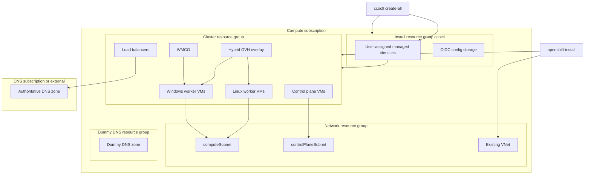

# OpenShift on Azure with Self-Managed DNS and Windows Worker Nodes

## Overview

Installer-provisioned infrastructure (IPI) on Azure normally assumes all resources deploy in the same subscription. This guide addresses three common enterprise constraints:

- **DNS** is managed in a **different subscription** or **outside Azure** — use user-provisioned DNS (generally available in OpenShift Container Platform **4.22**; Technology Preview in **4.21**).
- **Networking** is pre-provisioned in a **separate resource group within the same subscription** where the installer creates cluster resources — the OpenShift installer consumes an existing VNet and subnets rather than creating them.
- **Credentials** must use **Microsoft Entra Workload ID** with short-term credentials — cluster components authenticate via user-assigned managed identities created by `ccoctl`, not long-lived service principal secrets in `kube-system`.

The guide also covers the OVN-Kubernetes hybrid overlay configuration required to run **Linux and Windows Server 2025 worker nodes** in the same cluster. Windows workers are added post-install via WMCO and attach to the same pre-provisioned compute subnet as Linux workers.

Install commands are typically run from an **Azure VM bastion**. Credential selection is configured so `ccoctl` uses your interactive `az login` user rather than the VM's managed identity.

**Supported versions:** OpenShift Container Platform **4.22+** is recommended for user-provisioned DNS on Azure (GA) and **Windows Server 2025** worker nodes (WMCO). OpenShift Container Platform **4.21** supports the same workflow as Technology Preview and requires additional feature gates — see step 4 in Phase 1. For supported Windows Server versions, see [OCP 4.22 Windows Container Support](https://docs.redhat.com/en/documentation/openshift_container_platform/4.22/html-single/windows_container_support_for_openshift/index). For the DNS GA announcement, see [OCP 4.22 release notes](https://docs.redhat.com/en/documentation/openshift_container_platform/4.22/html/release_notes/ocp-4-22-release-notes).

Official references:
- [Installing a cluster with customizations on Azure](https://docs.redhat.com/en/documentation/openshift_container_platform/4.22/html-single/installing_on_azure/index#installation-initializing_installing-azure-customizations)
- [Reusing a VNet](https://docs.redhat.com/en/documentation/openshift_container_platform/4.22/html/installing_on_azure/installer-provisioned-infrastructure#installation-platform-azure-vnet_installing-azure-customizations)
- [Configuring an Azure cluster to use short-term credentials](https://docs.redhat.com/en/documentation/openshift_container_platform/4.22/html/installing_on_azure/installer-provisioned-infrastructure#cco-short-term-credentials_installing-azure-customizations)
- [Manual mode with short-term credentials (Microsoft Entra Workload ID)](https://docs.redhat.com/en/documentation/openshift_container_platform/4.22/html/authentication_and_authorization/managing-cloud-provider-credentials#cco-short-term-creds_managing-cloud-provider-credentials)

## Architecture


```mermaid
flowchart TB
  subgraph computeSub [Compute subscription]
    subgraph networkRG [Network resource group]
      VNet[Existing VNet]
      CPSubnet[controlPlaneSubnet]
      WorkerSubnet[computeSubnet]
    end
    subgraph installRG [Install resource group ccoctl]
      ManagedIds[User-assigned managed identities]
      OIDCStorage[OIDC config storage]
    end
    subgraph clusterRG [Cluster resource group]
      ControlPlane[Control plane VMs]
      LinuxWorkers[Linux worker VMs]
      WinWorkers[Windows worker VMs]
      LB[Load balancers]
      WMCO[WMCO]
      HybridOVN[Hybrid OVN overlay]
    end
    subgraph dummyDnsRG [Dummy DNS resource group]
      DummyZone[Dummy DNS zone]
    end
  end
  subgraph dnsElsewhere [DNS subscription or external]
    AuthZone[Authoritative DNS zone]
  end
  ccoctl[ccoctl create-all] --> installRG
  ccoctl --> ManagedIds
  Installer[openshift-install] --> VNet
  Installer --> clusterRG
  ManagedIds --> clusterRG
  ControlPlane --> CPSubnet
  LinuxWorkers --> WorkerSubnet
  WinWorkers --> WorkerSubnet
  WMCO --> WinWorkers
  HybridOVN --> LinuxWorkers
  HybridOVN --> WinWorkers
  LB --> AuthZone
```

- **Install resource group (`resourceGroupName` / `ccoctl --name`):** empty resource group created by `ccoctl` before installation. Scoped permissions for managed identities and OIDC configuration. Must match `platform.azure.resourceGroupName` in `install-config.yaml`. At runtime the installer creates `{infra_id}-rg` inside this scope for cluster VMs, load balancers, and disks.
- **Network resource group (same subscription):** pre-provisioned VNet, control plane subnet, and compute subnet. All cluster and Windows worker NICs attach to subnets here (`networkResourceGroupName`).
- **Dummy DNS resource group (same subscription):** empty DNS zone required by the installer when using user-provisioned DNS (`baseDomainResourceGroupName`). Also passed to `ccoctl` as `--dnszone-resource-group-name`. No customer-facing records are added here.
- **DNS subscription (or external DNS):** authoritative `api` and `*.apps` records customers use to reach the cluster.

## Prerequisites

1. The OpenShift installer and `oc` CLI are installed on the machine used to run installation commands.
2. The Azure CLI is installed. Authenticate with `az login` (interactive user account). Do **not** use `az login --identity` on the install VM if you intend to run `ccoctl` as a logged-in user.
3. **Installing from an Azure VM:** If the VM has a managed identity, `ccoctl` and the OpenShift installer may use that identity instead of your `az login` session. Before running `ccoctl` or `openshift-install`, force Azure CLI credentials as described in step 5.3, or remove managed identity from the install VM if it is not required for other workloads.
4. (Optional: Only needed when generating the install-config.yaml through the installer prompts) A dummy public DNS hosted zone for the desired base domain (e.g. `development.techcorp.com`) exists in the subscription where cluster resources will be deployed. No records are added to this zone — it satisfies the installer only.
5. The cluster name in `install-config.yaml` and the `ccoctl --name` value must **not** contain `windows`, `microsoft`, or similar words (Azure identity naming restriction). The `ccoctl --name` value must be **9 characters or fewer** if it becomes the Azure resource prefix.
6. A chosen **infra name** for `ccoctl azure create-all --name` (e.g. `demo1rg`). `ccoctl` creates an **empty** resource group with this name; it becomes `platform.azure.resourceGroupName` in `install-config.yaml`.
7. A VNet and subnets exist in a **network resource group** in the same subscription used for cluster installation.
8. Two subnets are available: one for the **control plane** (`controlPlaneSubnet`) and one for **compute/worker** nodes (`computeSubnet`). Windows workers use the compute subnet. The compute subnet (and its route table/NSG) must allow **outbound internet access** — WMCO downloads and installs the OpenSSH server from the Microsoft Store when configuring each Windows node.
9. The VNet CIDR contains the `networking.machineNetwork` CIDR you will set in `install-config.yaml`.
10. Subnets use Azure-assigned DHCP (not static IP assignments).
11. Network security group rules for required cluster ports (6443, 443, 22623, etc.) are in place **before** installation. See the [VNet NSG requirements](https://docs.redhat.com/en/documentation/openshift_container_platform/4.22/html/installing_on_azure/installer-provisioned-infrastructure#installation-platform-azure-vnet_installing-azure-customizations).
12. The Azure account used for `ccoctl` and installation has permissions to create resource groups, storage accounts, user-assigned managed identities, and role assignments in the subscription. See [Azure permissions for installer-provisioned infrastructure](https://docs.redhat.com/en/documentation/openshift_container_platform/4.22/html/installing_on_azure/installer-provisioned-infrastructure#installation-azure-permissions_installing-azure-customizations).

## Phase 1: Install the cluster

The steps below assume the OpenShift installer is installed on the machine you will use to run the following commands.

1. Create a new directory (avoid reusing an existing directory) to house the files required for installation of the cluster. e.g. `mkdir ocp-cluster; cd ocp-cluster`
2. Generate the installation files: `openshift-install create install-config --dir .`. Follow the prompts and select the correct options for your deployment. When prompted, provide the network resource group, VNet, and subnet names from your pre-provisioned network landing zone. Make sure to remember the cluster name — you will need it to create DNS records.
3. Open the newly created `install-config.yaml` file and configure replicas, `networking.machineNetwork`, `credentialsMode: Manual`, and the pre-provisioned network fields under `platform.azure` (see step 4).
4. Under `platform.azure`, reference your pre-provisioned VNet, enable user-provisioned DNS, and configure Microsoft Entra Workload ID. This guide requires `credentialsMode: Manual` in `install-config.yaml` (short-term credentials via `ccoctl`, not mint or passthrough mode). On OpenShift Container Platform **4.22+**, set `userProvisionedDNS: Enabled` — no feature gates are required. Set `platform.azure.resourceGroupName` to your chosen infra name (prerequisite 6) — it must match the `ccoctl azure create-all --name` value in step 5.4. The guide-specific fields in `install-config.yaml` should look like this (adjust values for your environment; do not copy pull secrets or SSH keys from this example):

```yaml
credentialsMode: Manual
baseDomain: development.techcorp.com
metadata:
  name: mycluster
networking:
  networkType: OVNKubernetes
  machineNetwork:
  - cidr: 10.0.0.0/16
  clusterNetwork:
  - cidr: 10.128.0.0/14
    hostPrefix: 23
platform:
  azure:
    region: eastus
    resourceGroupName: demo1rg
    baseDomainResourceGroupName: dummy-dns-rg
    networkResourceGroupName: example-network-rg
    virtualNetwork: example-vnet
    controlPlaneSubnet: example-controlplane-subnet
    computeSubnet: example-worker-subnet
    userProvisionedDNS: Enabled
```

Set `networking.machineNetwork` to an address range that fits within your VNet CIDR and the subnet ranges you provide. The installer creates cluster resources in its own resource group; it does **not** create the VNet or subnets.

See also: [examples/install-config.snippet.yaml](./examples/install-config.snippet.yaml)

**OCP 4.21 only (Technology Preview):** If you install on OpenShift Container Platform **4.21**, add these root-level attributes in `install-config.yaml` in addition to the fields above. They are **not** required on **4.22+**:

```yaml
featureSet: CustomNoUpgrade
featureGates: ["AzureClusterHostedDNSInstall=true"]
```

5. Configure Azure Workload Identities with short-term credentials using `ccoctl`. This creates user-assigned managed identities, OIDC configuration storage, and credential manifests for cluster components.

   5.1 Extract `ccoctl` from the release image:

```bash
RELEASE_IMAGE=$(openshift-install version | awk '/release image/ {print $3}')
oc adm release extract --command=ccoctl "${RELEASE_IMAGE}" -a pull-secret
chmod 775 ccoctl
```

   On RHEL 9 hosts, use `--command=ccoctl.rhel9` if the default binary does not run.

   See also: [examples/extract-ccoctl.example.sh](./examples/extract-ccoctl.example.sh)

   5.2 Extract `CredentialsRequest` objects filtered for your `install-config.yaml`:

```bash
oc adm release extract --from="${RELEASE_IMAGE}" \
  --credentials-requests --included \
  --install-config=./install-config.yaml \
  --to=./credrequests \
  -a pull-secret
```

   5.3 Authenticate as the logged-in user (not the VM managed identity).

   On an Azure VM, `ccoctl` uses `DefaultAzureCredential`, which tries the VM managed identity **before** `az login`. Clear identity-related environment variables and restrict credential discovery to the Azure CLI:

```bash
unset AZURE_CLIENT_ID AZURE_CLIENT_SECRET AZURE_TENANT_ID \
  AZURE_FEDERATED_TOKEN_FILE AZURE_AUTHORITY_HOST

az login
az account set --subscription "<subscription_id>"

# Force ccoctl to use az login credentials, not the VM managed identity
export AZURE_TOKEN_CREDENTIALS=AzureCLICredential
```

   Verify you are using the intended account:

```bash
az account show --query "{subscription:id, user:user.name, tenant:tenantId}" -o table
az ad signed-in-user show --query "{displayName:userPrincipalName}" -o table
```

   If you previously ran the installer on this VM and it created a managed-identity profile, remove it:

```bash
rm -f ~/.azure/osServicePrincipal.json
```

   When you run `openshift-install create install-config` or `create manifests`, provide a **service principal** `clientId` and `clientSecret` with install permissions. On a VM with managed identity, do not leave both blank — the installer will use the VM identity instead of your user account.

   **Alternative (service principal):** To bypass both managed identity and `az login`, export explicit credentials before `ccoctl` and unset `AZURE_TOKEN_CREDENTIALS`:

```bash
export AZURE_CLIENT_ID="<service_principal_app_id>"
export AZURE_CLIENT_SECRET="<service_principal_password>"
export AZURE_TENANT_ID="<tenant_guid>"
unset AZURE_TOKEN_CREDENTIALS
```

   5.4 Create Azure resources and credential manifests with `ccoctl azure create-all`. Keep `AZURE_TOKEN_CREDENTIALS=AzureCLICredential` set in the same shell session.

   The `--name` argument must **exactly match** `platform.azure.resourceGroupName` in `install-config.yaml`. `ccoctl` creates an empty resource group with that name; the installer deploys cluster resources into it. Prefer reading values from `install-config.yaml` rather than hardcoding them:

```bash
export AZURE_TOKEN_CREDENTIALS=AzureCLICredential

TENANT_ID=$(az account show --query tenantId -o tsv)
SUBSCRIPTION_ID=$(az account show --query id -o tsv)

INFRA_NAME=$(yq -r '.platform.azure.resourceGroupName' install-config.yaml)
REGION=$(yq -r '.platform.azure.region' install-config.yaml)
DNS_ZONE_RG=$(yq -r '.platform.azure.baseDomainResourceGroupName' install-config.yaml)
NETWORK_RG=$(yq -r '.platform.azure.networkResourceGroupName' install-config.yaml)

if [[ -z "${INFRA_NAME}" || "${INFRA_NAME}" == "null" ]]; then
  echo "Set platform.azure.resourceGroupName in install-config.yaml before running create-all." >&2
  exit 1
fi

./ccoctl azure create-all \
  --name="${INFRA_NAME}" \
  --output-dir=./ccoctl-output \
  --region="${REGION}" \
  --subscription-id="${SUBSCRIPTION_ID}" \
  --tenant-id="${TENANT_ID}" \
  --credentials-requests-dir=./credrequests \
  --dnszone-resource-group-name="${DNS_ZONE_RG}" \
  --network-resource-group-name="${NETWORK_RG}" \
  --preserve-existing-roles
```

   Requires [yq](https://github.com/mikefarah/yq) to parse `install-config.yaml`. On OCP 4.21 Technology Preview installs, add `--enable-tech-preview`.

   See also: [examples/ccoctl-azure-create-all.example.sh](./examples/ccoctl-azure-create-all.example.sh)

   5.5 Confirm `platform.azure.resourceGroupName` in `install-config.yaml` still matches the `--name` value used in step 5.4 before you run `openshift-install create manifests`.

6. To run both Linux and Windows nodes in the same cluster, configure hybrid networking in OVN-Kubernetes. Generate installation manifests from `install-config.yaml`. This process will **consume** the `install-config.yaml` file, so back it up first. See the [hybrid OVN-Kubernetes documentation](https://docs.redhat.com/en/documentation/openshift_container_platform/4.22/html-single/installing_on_azure/index#configuring-hybrid-ovnkubernetes_installing-azure-customizations) for details.

   6.1 Generate manifest files: `openshift-install create manifests --dir .`

   6.2 Copy Workload Identity manifests and TLS signing keys from `ccoctl` output:

```bash
cp ccoctl-output/manifests/* ./manifests/
cp -a ccoctl-output/tls .
```

   6.3 Create the hybrid network manifest: `touch manifests/cluster-network-03-config.yml`

   6.4 Edit the file and add the following content. Set `hybridClusterNetwork.cidr` to a range that **does not overlap** with `networking.clusterNetwork` in your backed-up `install-config.yaml`. For example, if `clusterNetwork` is `10.128.0.0/14`, use the next block such as `10.132.0.0/14`:

```yaml
apiVersion: operator.openshift.io/v1
kind: Network
metadata:
  name: cluster
spec:
  defaultNetwork:
    ovnKubernetesConfig:
      hybridOverlayConfig:
        hybridClusterNetwork:
        - cidr: 10.132.0.0/14
          hostPrefix: 23
```

   Do **not** set `hybridOverlayVXLANPort` on Azure. That setting is required only for vSphere clusters.

   See also: [examples/cluster-network-03-config.yml](./examples/cluster-network-03-config.yml)

   6.5 Save the changes and back up the file in case you need to recreate the cluster.

   6.6 Deploy the cluster: `openshift-install create cluster --dir . --log-level=info`

   6.7 When user-provisioned DNS is enabled, cluster components can reach the control plane, but the installer host cannot resolve cluster-internal DNS. When you see `INFO Waiting up to 45m0s (until X:XX XX) for bootstrapping to complete`, update the **authoritative** hosted zone (not the dummy zone) as described below.

### Update authoritative DNS to complete installation

Note: To collect IPs using the Azure CLI, see [Provisioning your own DNS records](https://docs.redhat.com/en/documentation/openshift_container_platform/4.22/html-single/installing_on_azure/index#installation-azure-provisioning-own-dns-records_installing-azure-customizations).

1. Collect the public IP for the API server from the public load balancer created by the installer — the load balancer whose name **does not** end with `-int`, for the rule listening on port **6443**.
2. Add an A record for `api.<cluster_name>.<base_domain>` pointing to that IP.
3. Collect the public IP for the Ingress/routes endpoint (required for the OpenShift web console) from the same public load balancer, for the rule listening on port **443**. It may take about 10 minutes for this rule to appear.
4. Add an A record for `*.apps.<cluster_name>.<base_domain>` pointing to the Ingress IP.

Windows workers require an additional `api-int` record — see Phase 2.

## Phase 2: Deploy Windows worker nodes

Note: The commands below assume your `oc` context is set to the installed cluster.

### Prerequisites

Before deploying Windows Server 2025 workers:

1. Phase 1 completed successfully on OpenShift Container Platform **4.22+** (WMCO supports Windows Server 2025, OS build 10.0.26100+).
2. Your cluster has the **Red Hat OpenShift support for Windows Containers** subscription (required to install WMCO from `redhat-operators`).
3. The cluster Azure **region** publishes the Windows Server 2025 image `MicrosoftWindowsServer/WindowsServer/2025-datacenter-smalldisk`. Verify before applying the MachineSet if provisioning fails.

Windows node bootstrap requires outbound connectivity from the **compute subnet** to the internet (or an approved egress path). WMCO installs OpenSSH on each Windows VM by downloading it from the **Microsoft Store** during node configuration. Restricted subnets without outbound access will cause Windows Machines to stall or fail during WMCO setup.

Before applying a Windows MachineSet, create the `api-int` DNS record as described below. Windows worker bootstrap requires this record; Linux workers do not.

### Create api-int DNS record for Windows workers

Windows VMs resolve the internal Kubernetes API at `api-int.<cluster_name>.<base_domain>` using your **authoritative** hosted zone (the same zone as `api` and `*.apps`, not the dummy zone) until WMCO finishes configuring them as worker nodes. The record must point to the **private IP** of the internal load balancer (`${infra_id}-internal`), not the public API load balancer.

1. In the cluster resource group, identify the internal load balancer named `${infra_id}-internal` (the load balancer whose name ends with `-internal`). Get `${infra_id}` from:

   `oc get infrastructure cluster -o jsonpath='{.status.infrastructureName}'`

2. Collect the **private** IP from the load balancer rule listening on port **6443**.

   Optional Azure CLI:

```bash
infra_id=$(oc get infrastructure cluster -o jsonpath='{.status.infrastructureName}')
cluster_resource_group_name="${infra_id}-rg"
lb_name="${infra_id}-internal"

frontendipconfig_id=$(az network lb show -n "${lb_name}" -g "${cluster_resource_group_name}" \
  --query "loadBalancingRules[?frontendPort==\`6443\`].frontendIPConfiguration.id | [0]" -o tsv)

frontendipconfig_name=${frontendipconfig_id##*/}

az network lb frontend-ip show -n "${frontendipconfig_name}" --lb-name "${lb_name}" \
  -g "${cluster_resource_group_name}" --query "privateIPAddress" -o tsv
```

   The last command prints the private IP to use for the `api-int` A record in step 3.

3. In your authoritative hosted zone, add an **A record** for `api-int.<cluster_name>.<base_domain>` pointing to that private IP.

4. Verify the record in your **authoritative DNS zone**.

```bash
dig +noall +answer @8.8.8.8 api-int.<cluster_name>.<base_domain>
```

   Confirm the returned A record IP matches the internal load balancer private IP from step 2.

### Install WMCO and create a Windows MachineSet

1. Deploy the Windows Machine Config Operator (WMCO): `oc apply -f ./wmco-subscription.yaml`
2. Wait a few minutes for the operator deployment request to reconcile.
3. Verify the operator deployed successfully — the CSV phase column should show `Succeeded`:

   `oc get csv -n openshift-windows-machine-config-operator`

4. Create a new SSH keypair for the operator to communicate with Windows hosts. It is **recommended** that this key differ from the cluster installation key:

   `ssh-keygen -t ecdsa -b 256 -f ./windows_ecdsa`

5. Create the secret required by the operator:

   `oc create secret generic cloud-private-key --from-file=private-key.pem=./windows_ecdsa -n openshift-windows-machine-config-operator`

6. Confirm WMCO created the `windows-user-data` secret in `openshift-machine-api`. This secret is created when WMCO deploys. Verify with:

   `oc -n openshift-machine-api get secret windows-user-data`

   If the secret is missing, check the WMCO CSV, operator pods, and events.

7. Create a Windows Server 2025 MachineSet using [azure-machineset_windows_2025.yaml](./azure-machineset_windows_2025.yaml). The MachineSet name must be **9 characters or fewer** on Azure. Set network placeholders to match your backed-up `install-config.yaml` — **not** the installer-default `{infra_id}-vnet` / `{infra_id}-worker-subnet` names. The template uses SKU `2025-datacenter-smalldisk`. Container workloads on Windows Server 2025 nodes must use matching base images (for example `ltsc2025` tags and the `windows2025` RuntimeClass — see [OCP Windows Container Support](https://docs.redhat.com/en/documentation/openshift_container_platform/4.22/html-single/windows_container_support_for_openshift/index)). Example for a MachineSet named `win1` in `eastus` AZ `1`:

```bash
cat ./azure-machineset_windows_2025.yaml | \
  sed "s/<infrastructure_id>/$(oc get infrastructure cluster -o jsonpath='{.status.infrastructureName}')/g" | \
  sed "s/<windows_machine_set_name>/win1/g" | \
  sed "s/<location>/eastus/g" | \
  sed "s/<zone>/1/g" | \
  sed "s/<network_resource_group>/example-network-rg/g" | \
  sed "s/<vnet_name>/example-vnet/g" | \
  sed "s/<compute_subnet>/example-worker-subnet/g" | \
  oc apply -f -
```

Replace `example-network-rg`, `example-vnet`, and `example-worker-subnet` with the values from `platform.azure.networkResourceGroupName`, `platform.azure.virtualNetwork`, and `platform.azure.computeSubnet` in your install-config backup.

**Legacy (Windows Server 2022):** Use [azure-machineset_windows_2022.yaml](./azure-machineset_windows_2022.yaml) with SKU `2022-datacenter` if your region or workload requirements require Windows Server 2022 instead of 2025.

8. Verify the MachineSet created a **Machine** resource. A Windows worker node will not appear immediately — bootstrapping takes time:

```bash
oc get machineset.machine win1 -n openshift-machine-api
oc get machines.machine -n openshift-machine-api -l machine.openshift.io/cluster-api-machineset=win1
```

   Wait for the Machine to reach `Running` phase and for WMCO to finish configuring the VM before expecting a node.

9. After bootstrap completes (this may take 10+ minutes), verify the Windows **node** joined the cluster:

```bash
oc get nodes -l node.openshift.io/os_id=Windows
```

## Troubleshooting

| Symptom | Likely cause | Fix |
|---------|--------------|-----|
| Installer stuck at bootstrap | External DNS not pointing to API load balancer | Add `api.<cluster>.<base_domain>` A record; verify resolution from the install bastion |
| Console unreachable | Missing `*.apps.*` DNS record | Wait for the port 443 load balancer rule (~10 min), then add the Ingress IP |
| Install fails validating subnets | Wrong subnet names or network resource group | Verify `networkResourceGroupName`, `virtualNetwork`, `controlPlaneSubnet`, and `computeSubnet` in `install-config.yaml` |
| Install fails on Azure API / NSG | Missing NSG rules on network subnets | Apply required port rules before install (see Red Hat VNet NSG requirements) |
| `ccoctl azure create-all` fails on DNS zone RG | Missing or wrong `--dnszone-resource-group-name` | Set to `platform.azure.baseDomainResourceGroupName` (dummy DNS RG) |
| `ccoctl create-all` permission errors on Azure VM | VM managed identity used instead of logged-in user | `export AZURE_TOKEN_CREDENTIALS=AzureCLICredential` after `az login`; unset `AZURE_CLIENT_ID` if set for a VM user-assigned identity |
| Installer uses VM managed identity despite `az login` | `~/.azure/osServicePrincipal.json` has no client secret | `rm ~/.azure/osServicePrincipal.json` and provide service principal `clientId` + `clientSecret` when prompted |
| Wrong Azure subscription used | Stale `az` session | `az account set --subscription "<subscription_id>"` and verify with `az account show` |
| Install fails on resource group | `resourceGroupName` ≠ `ccoctl --name` or RG not empty | Align names; use a new empty resource group created by `ccoctl` |
| Components lack Azure permissions after install | `ccoctl` manifests or `tls` not copied | Run `cp ccoctl-output/manifests/* ./manifests/` and `cp -a ccoctl-output/tls .` before `create cluster` |
| `ccoctl` fails to run | Wrong binary architecture or not extracted | Re-extract with `--command=ccoctl.rhel9` on RHEL 9 hosts |
| Install fails validating `userProvisionedDNS` on OCP 4.21 | Feature gate not enabled | Add `featureSet: CustomNoUpgrade` and `featureGates: ["AzureClusterHostedDNSInstall=true"]` to `install-config.yaml` (4.21 only; not required on 4.22+) |
| `windows-user-data` missing after WMCO install | WMCO failed to reconcile on deploy | Check WMCO operator pods, logs, and events — do not wait for a MachineSet |
| Windows Machine fails to provision | MachineSet uses installer-default VNet/subnet names | Set `networkResourceGroup`, `vnet`, and `subnet` to pre-provisioned values from install-config |
| Windows Machine fails to provision (image not found) | Windows Server 2025 SKU unavailable in region | Run `az vm image list --publisher MicrosoftWindowsServer --offer WindowsServer --sku 2025-datacenter-smalldisk -l <region>`; use another region or the legacy 2022 template |
| Windows Machine stuck / node never Ready | Compute subnet blocks outbound internet | Allow egress from the compute subnet so WMCO can download OpenSSH from the Microsoft Store |
| Windows Machine / node fails to join | Missing or wrong `api-int` DNS for Windows workers | Add A record for `api-int.<cluster>.<base_domain>` → private IP of `${infra_id}-internal` LB; verify with `dig @8.8.8.8 api-int...` — do not rely on resolution from a Linux worker node (cluster DNS) |
| MachineSet fails or VM name error | MachineSet name too long for Azure | MachineSet name must be **9 characters or fewer** |
| Install timed out after DNS was fixed | Installer did not resume automatically | Run `openshift-install wait-for install-complete --dir . --log-level=info` |

## Reference files

| File | Purpose |
|------|---------|
| [examples/install-config.snippet.yaml](./examples/install-config.snippet.yaml) | Guide-specific `install-config.yaml` fields including Manual mode, pre-provisioned VNet, and Workload Identity resource group |
| [examples/extract-ccoctl.example.sh](./examples/extract-ccoctl.example.sh) | Extract `ccoctl` and `CredentialsRequest` objects from the release image |
| [examples/ccoctl-azure-create-all.example.sh](./examples/ccoctl-azure-create-all.example.sh) | Run `ccoctl azure create-all` with guide-specific parameters |
| [examples/cluster-network-03-config.yml](./examples/cluster-network-03-config.yml) | Hybrid OVN-Kubernetes overlay manifest |
| [wmco-subscription.yaml](./wmco-subscription.yaml) | WMCO OperatorGroup and Subscription |
| [azure-machineset_windows_2025.yaml](./azure-machineset_windows_2025.yaml) | **Primary** — Windows Server 2025 MachineSet template |
| [azure-machineset_windows_2022.yaml](./azure-machineset_windows_2022.yaml) | **Legacy** — Windows Server 2022 MachineSet template |
